# Employee Management System (EMS)

EMS is a web-based application developed using ReactJS and Java for managing employee information, attendance, leave requests, and salary details. It provides a user-friendly interface for both employees and administrators to perform various tasks efficiently.

## Features

- **User Authentication**: Employees can register and login to their accounts securely. Employees can also login using OTP and reset password.
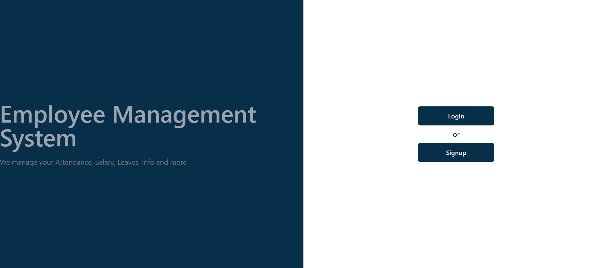
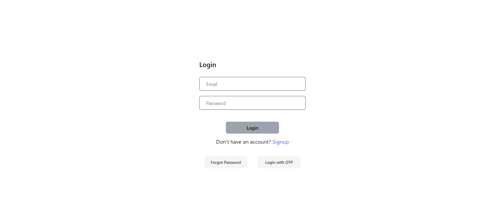
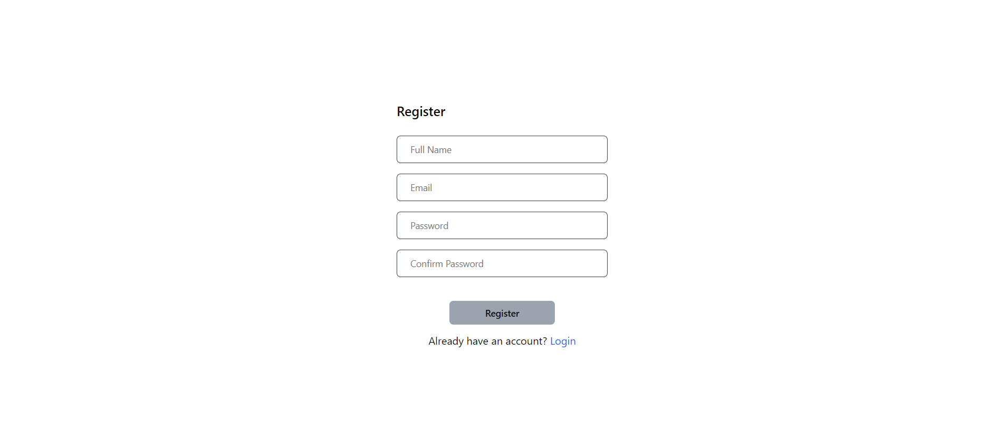

- **Profile Management**: Employees can update their personal information, view salary details, and check their leave request status.
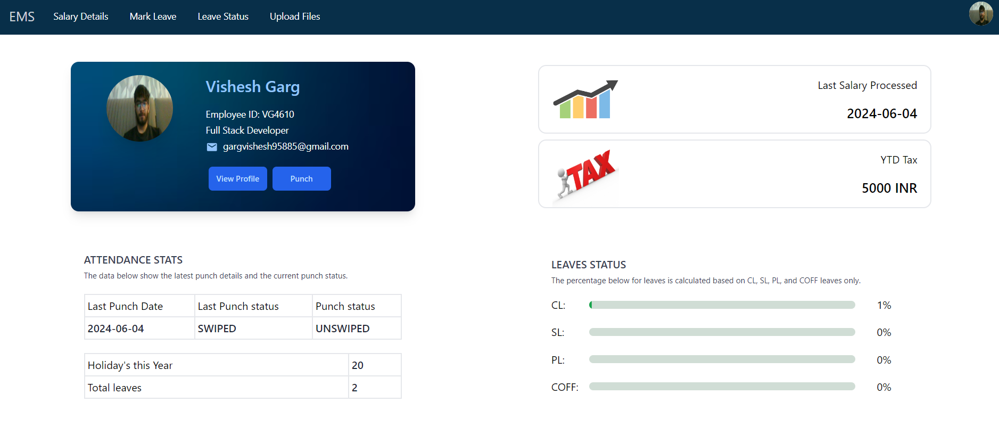
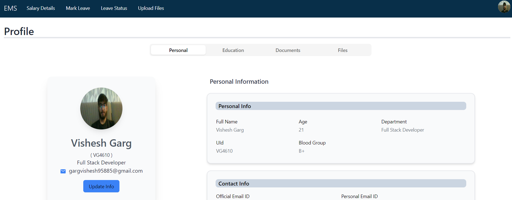
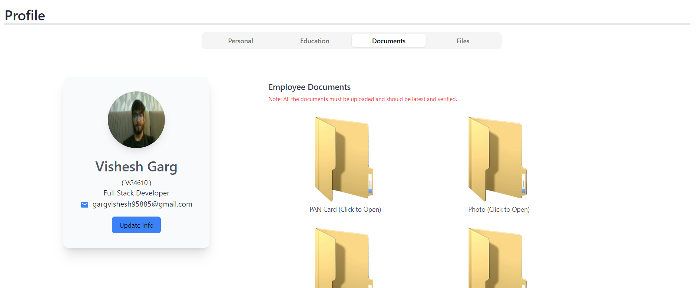

- **File upload**: Employee can upload his/her office related files and can view or download them.
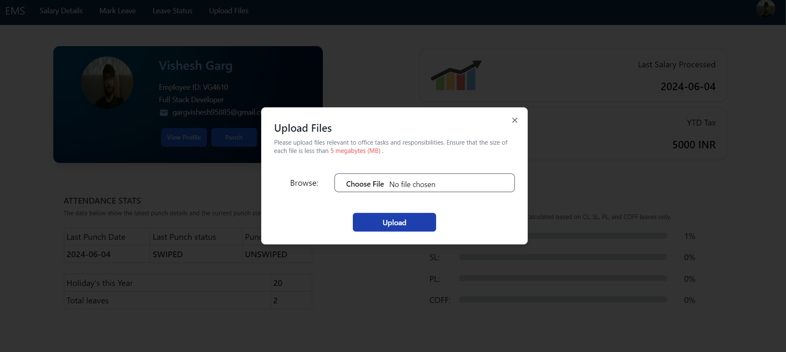

- **Salary panel**: Employee can view his/her salary data for specific month and year.
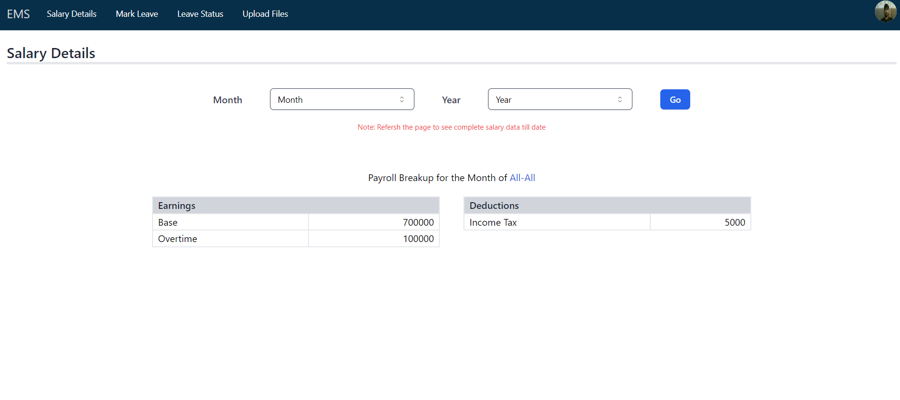

- **Attendance Management**: Employees can punch in/out within the location of the office. Administrators can view punching status for all employees.
  
- **Leave Management**: Employees can submit leave requests, and administrators can approve or reject them.
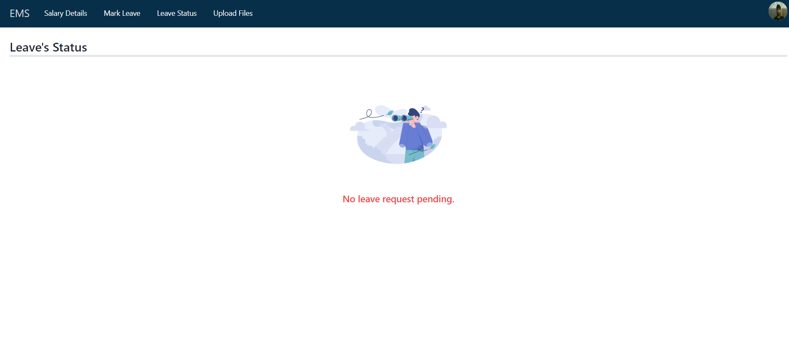

- **Admin Panel**: Administrators have access to additional functionalities like updating employee information, adding employee salaries, and managing leave requests.
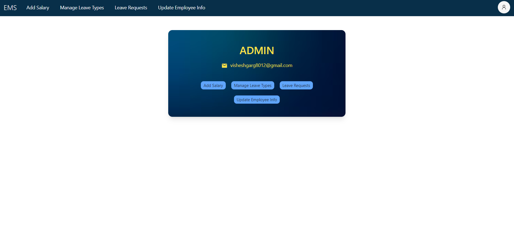
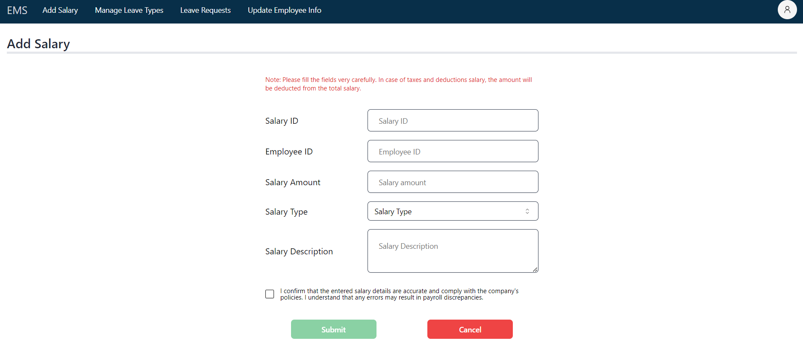

## Technologies Used

- **Frontend**: ReactJS, Tailwind, Redux
- **Backend**: Java
- **Database**: MySQL
